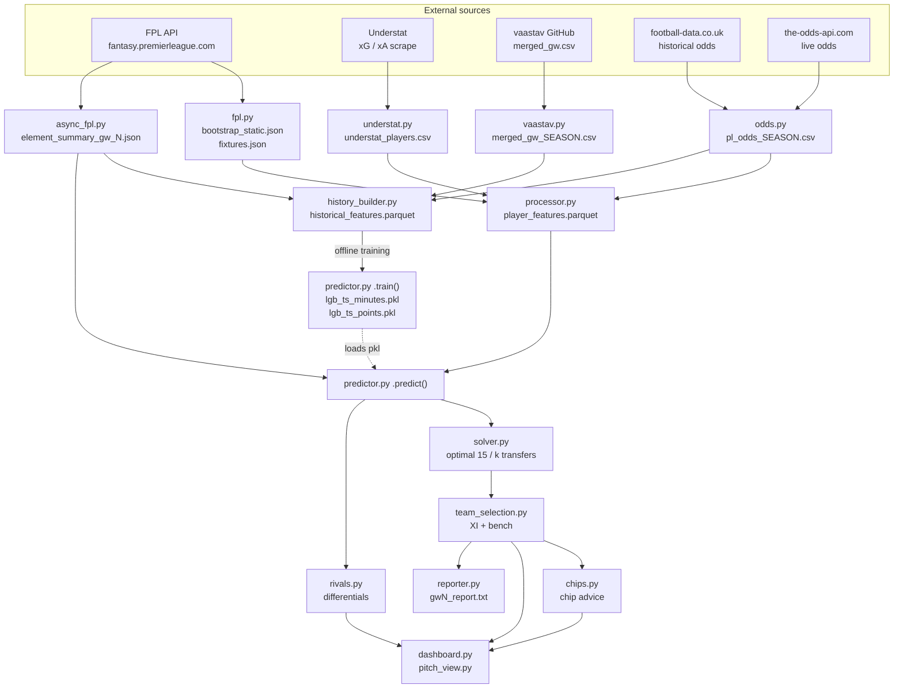

# FPL AI Engine — Architecture & Maintenance Guide

> A Fantasy Premier League decision engine: it ingests FPL/Understat/bookmaker data,
> trains a two-stage LightGBM model to project points per player per gameweek, then
> solves an integer program for the optimal 15-man squad, transfers, captaincy and
> chip usage — surfaced through a Streamlit dashboard.

**Version in UI:** `FPL AI Engine v2.2` · **Python:** 3.11 (`runtime.txt`) · **Deploy target:** Streamlit Cloud

---

## 1. The one-paragraph mental model

There are **two independent runtimes** over one shared pipeline.
`src/interface/dashboard.py` (Streamlit, the real product) and `src/main.py` (CLI, older/thinner)
both do the same five steps: **fetch → featurize → predict → optimize → present**.
Everything else in `src/` is one of those five steps. The model is trained *offline* by running
`src/model/predictor.py` directly; the app only ever *loads* the `.pkl`. If the pkl is missing,
prediction degrades loudly to a heuristic rather than crashing.

---

## 2. Directory map

```
s.genie-1/
├── src/
│   ├── main.py                    # CLI entrypoint (fetch → predict → optimize → text report)
│   ├── api/                       # ── LAYER 1: data acquisition
│   │   ├── fpl.py                 #   Official FPL API (sync). Squad picks, chips, FT count, leagues
│   │   ├── async_fpl.py           #   Bulk element-summary fetch (aiohttp, 20-way concurrency) → cache
│   │   ├── understat.py           #   Scrapes xG/xA from understat.com league page (regex on JS var)
│   │   ├── vaastav.py             #   Downloads historical merged_gw.csv from vaastav/Fantasy-Premier-League
│   │   └── odds.py                #   Bookmaker odds: football-data.co.uk (history) + the-odds-api (live)
│   ├── features/                  # ── LAYER 2: feature engineering
│   │   ├── processor.py           #   INFERENCE features → data/processed/player_features.parquet
│   │   └── history_builder.py     #   TRAINING features → data/processed/historical_features.parquet
│   ├── model/
│   │   └── predictor.py           # ── LAYER 3: MinutesPredictor + PointsPredictor (LightGBM) + audit
│   ├── optimization/              # ── LAYER 4: decisions
│   │   ├── solver.py              #   PuLP/CBC integer program: best 15, and best-k-transfers search
│   │   ├── team_selection.py      #   Greedy split of 15 → starting XI + bench (formation-legal)
│   │   └── chips.py               #   Wildcard / Free Hit / Bench Boost / Triple Captain advisor
│   ├── analysis/
│   │   └── rivals.py              # ── Head-to-head differential analysis vs a league rival
│   └── interface/                 # ── LAYER 5: presentation
│       ├── dashboard.py           #   Streamlit app (4 tabs). THE primary entrypoint.
│       ├── pitch_view.py          #   HTML/CSS football-pitch renderer with shirt/photo resolution
│       └── reporter.py            #   Plain-text GW report (CLI path only)
├── data/                          # entirely .gitignored — see §7 Bootstrapping
│   ├── raw/                       #   bootstrap_static.json, fixtures.json, vaastav/, odds/
│   ├── cache/                     #   element_summary_gw_{N}.json, live_odds.json
│   ├── processed/                 #   player_features.parquet, historical_features.parquet
│   ├── models/                    #   lgb_ts_points.pkl, lgb_ts_minutes.pkl + versioned per-GW copies
│   └── reports/                   #   predictions_gw{N}.csv
├── debug_*.py                     # 8 ad-hoc probe scripts (see §8)
├── requirements.txt, runtime.txt
```

---

## 3. Data flow



---

## 4. Layer-by-layer reference

### 4.1 `src/api/` — acquisition

**`fpl.py :: FPLClient`** — the workhorse. Un-authenticated GETs against the public FPL API with a
browser User-Agent. Saves raw JSON to `data/raw/` for inspection.

| Method | Endpoint | Notes |
|---|---|---|
| `get_bootstrap_static()` | `bootstrap-static/` | players (`elements`), `teams`, `events` (gameweeks) |
| `get_fixtures()` | `fixtures/` | includes `team_h_difficulty` / `team_a_difficulty` (FDR) |
| `get_player_summary(id)` | `element-summary/{id}/` | per-GW history; **not** saved to disk here |
| `get_transfers(team_id)` | `entry/{id}/transfers/` | drives FT calculation |
| `get_history(team_id)` | `entry/{id}/history/` | contains `chips` list — feeds `ChipStrategy` |
| `get_league_standings(id)` | `leagues-classic/{id}/standings/` | manager dropdown + Rival Spy |
| `calculate_free_transfers()` | derived | replays GW1→now: start 1 FT, +1/week, cap 5, floor 0 (2024/25 rules) |
| `get_team_picks()` | `entry/{id}/event/{gw}/picks/` | see the **Free Hit trap** below |

> **⚠️ The Free Hit trap** ([fpl.py:108](src/api/fpl.py#L108)) — this is the single most-patched
> piece of logic in the repo (4 commits). `get_team_picks` walks *backwards* from `gw-1` looking for
> a squad. If the manager played Free Hit in that GW, the API returns the **temporary FH squad**, not
> their permanent team — which then leaks into next week's recommendations. The fix: callers pass
> `freehit_gws` (a **set** — a manager may play two FH chips per season, one either side of GW20) and
> those GWs are skipped. `dashboard.py` builds this set from `get_history()['chips']`.

**`async_fpl.py :: AsyncFPLClient`** — fetches all ~700 `element-summary` endpoints concurrently
(semaphore of 20) and writes one combined `data/cache/element_summary_gw_{N}.json`. Cache-first: if
the file exists it is returned without any network call.

> **⚠️ Pipeline gap:** nothing in `main.py` or `dashboard.py` calls this. The cache file is a hard
> dependency of both `PointsPredictor.predict()` and `HistoryBuilder._load_current_season()`, so it
> must be produced manually: `python src/api/async_fpl.py`. Forgetting this is the #1 cause of the
> emergency-heuristic fallback firing.

**`odds.py :: OddsClient`** — converts bookmaker decimal odds into modelling features.
Method: invert odds → implied probability → divide by the overround (`margin`) to remove the
bookmaker's edge. Over/Under 2.5 odds are mapped to total implied goals via a **linear approximation**
(`total_goals = 1.5 + P(over2.5) * 2.5`), split between teams by win-probability ratio, and clean-sheet
probability comes from a Poisson tail `P(opponent scores 0) = e^(-λ_opponent)`.

- `LEAGUE_DEFAULTS` — the fallback dict (33/33/33, 1.35 goals, 0.30 CS). Every odds path degrades to this.
- `POSITION_GOAL_SHARE` — FWD 0.32 / MID 0.22 / DEF 0.06 / GK 0.001, used by
  `compute_anytime_scorer_prob()` = `1 - e^(-team_goals × share)`.
- `TEAM_NAME_NORMALIZE` — football-data.co.uk → FPL/vaastav naming (`Man United`→`Man Utd`, `Tottenham`→`Spurs`).
- Live odds require the **`ODDS_API_KEY`** env var. Without it: no live odds → defaults → the model
  reports `odds_confidence = "LOW"` and degrades captaincy ranking. Live responses are cached 6h.

### 4.2 `src/features/` — the two feature builders

This is the part most likely to bite you: **there are two parallel implementations of the same
rolling features and they must stay in sync.**

| | `history_builder.py` (TRAIN) | `processor.py` + `predictor.predict()` (INFER) |
|---|---|---|
| Output | `historical_features.parquet` | `player_features.parquet` (+ rolling cols merged at predict time) |
| Source | vaastav CSVs + current-season cache | `bootstrap_static.json` + Understat + current-season cache |
| Grain | one row per player **per GW** | one row per player (next GW only) |
| Rolling features | `groupby(season, player_id).shift(1).rolling(3/5)` | recomputed inline from `element_summary` history lists |
| Has target? | yes (`target`, `target_minutes`) | no |

**Anti-leakage is the whole point of `history_builder`** ([history_builder.py:174](src/features/history_builder.py#L174)):
every rolling window is `.shift(1)`-ed first, so GW *N*'s features never see GW *N*'s outcome.
`predictor._get_feature_cols()` independently drops the same-GW columns (`minutes`, `bps`, `expected_*`,
`influence`, `creativity`, `threat`, `starts`) as a second line of defence.

The 11 `rolling_cols`: `minutes, total_points, expected_goals, expected_assists,
expected_goal_involvements, expected_goals_conceded, bps, influence, creativity, threat, starts`.
Each becomes `{col}_last_1`, `{col}_mean_last_3`, `{col}_mean_last_5`. Plus `benched_sum_last_3/5`
(from `starts == 0`) and `days_rest` (gap between consecutive kickoff times).

Double gameweeks are collapsed by `groupby(['player_id','GW']).agg(sum for stats, mean for price)`.

**`processor.py`** additionally computes: `price = now_cost/10`, `xG_per_90`/`xA_per_90` (Understat
minutes-normalised), `minutes_prob = chance_of_playing_next_round/100` (default 100), `ppm`,
`fixture_difficulty` (mean FDR over the **next 5** fixtures), `next_opponent` string, `team_code`, and
the odds block. It **caches** to parquet and only regenerates when a required column is absent — the
dashboard therefore calls `process(force_refresh=True)` to be safe.

### 4.3 `src/model/predictor.py` — the two-stage model

```
Stage 1  MinutesPredictor  →  projected_minutes  (LightGBM regression, clipped 0–90)
Stage 2  PointsPredictor   →  predicted_points   (LightGBM regression, clipped ≥0)
```

`MinutesPredictor` uses a fixed 12-feature list (minutes/starts/benched rollups, `days_rest`,
`position`, `price`, `team`), 100 rounds, lr 0.05. Its output plus `start_probability`
(`projected_minutes > 45`) is fed into stage 2 as a feature.

`PointsPredictor.train()` runs an **A/B feature-set experiment** before final training:
- **Set A** = projected minutes only (raw minutes/starts/benched columns removed)
- **Set B** = projected minutes + all raw minute columns

Both are scored with expanding-window time-series CV on 2023-24 (`GW1-20 → GW21-25`, `GW1-25 → GW26-30`),
early stopping at 50 rounds. **Set A wins ties** (`rmse_A <= rmse_B + 0.05`) — a deliberate bias toward
the simpler, less leakage-prone feature set. Final model: 150 rounds, lr 0.03, L1 0.1 / L2 1.0, bagging 0.8.

Artifacts are saved twice: `lgb_ts_points.pkl` (the live one) and `points_model_gw{N}.pkl` (versioned
audit trail). The pickle carries `train_feature_means` for drift detection and a `trained_at` timestamp.

**Post-processing in `predict()`** — worth knowing because it shapes every downstream number:
- `predicted_points *= minutes_prob` (injury/availability haircut, NaN→1.0)
- `captaincy_score = predicted_points × (0.6 + 0.4·min_conf) × (0.7 + 0.3·win_prob)` where
  `min_conf = projected_minutes/90`. Captaincy is deliberately **not** raw XP — it penalises
  rotation risk and bad fixtures.
- `odds_confidence` = `HIGH` if any odds column varies across rows, else `LOW` (all-identical means
  the league defaults are in play).

**Fallback safety** — `_emergency_heuristic()` fires when the pkl is missing, `data/cache/` is absent,
or no `element_summary` file exists. It prints a 60-character banner of `!`, sets
`prediction_mode = "fallback"`, and scores `0.4 × points_mean_last_3 + 2.0 × xGI_mean_last_3`.
Callers can inspect `predictor.prediction_mode` / `.prediction_warnings` / `.odds_confidence`.

**`generate_audit_report()`** is the debugging entry point — feature gain ranking, holdout RMSE
(2023-24 GW30+) sliced by position and price band, top-20 predictions, top-5 captains, "prediction
surprises" (model vs recent form), a >20% feature-drift table, and a CSV to `data/reports/`.

### 4.4 `src/optimization/`

**`solver.py :: TransferOptimizer`** — PuLP with the bundled CBC solver, binary var per player.

*Constraints (both methods):* budget, squad = 15, **GK 2 / DEF 5 / MID 5 / FWD 3**, max 3 per club.

`solve_team()` = unconstrained rebuild (used for Wildcard/Free Hit simulation).

`recommend_transfers()` handles the fact that hit cost `max(0, k - FT) × 4` is **non-linear** by
brute-forcing it: solve a separate IP for **exactly k ∈ {0,1,2,3}** transfers, then pick the best
*net* score after subtracting the hit penalty. `k` is hard-capped at 3 to stop the solver churning the
whole squad.

**`team_selection.py :: select_starting_xi()`** — greedy, not optimal: lock in the best GK + minimum
formation (3 DEF, 2 MID, 1 FWD), then fill the remaining 4 slots from the pooled leftovers in XP order,
respecting maxima (5/5/3). Returns `(starters, bench)` sorted by XP.

**`chips.py :: ChipStrategy`** — reads used chips from `history['chips']` (`wildcard`, `freehit`,
`bboost`, `3xc`). Thresholds:

| Chip | Recommended | Consider | Save |
|---|---|---|---|
| Bench Boost | bench XP > 18 | > 12 | ≤ 12 |
| Triple Captain | top XP ≥ 11.0 | ≥ 8.0 | < 8.0 |
| Wildcard | rebuild gain > 20 | > 12 | ≤ 12 |
| Free Hit | active players < 9 (crisis) **or** gain > 25 | — | otherwise |

**Chip restoration** (`_is_chip_available`, `GW_RESTORATION_THRESHOLD = 20`): a chip used **before**
GW20 becomes available again from GW20 (FPL's second-half chip set). Recommendations for restored
chips get a `[RESTORED 2nd CHIP]` prefix.

### 4.5 `src/interface/`

**`dashboard.py`** — the Streamlit app, four tabs:

1. **🚀 Optimized Squad** — chip advisor expander (incl. a rendered ideal Wildcard XI), captaincy
   recommendation, pitch view, transfer/hit summary with net XP after the `-4`s.
2. **🔄 Transfer Analysis** — per-swap OUT→IN cards with player photos, an *AI Confidence* badge
   (`data_freshness × minutes_prob`, where freshness decays over 48h from `bootstrap_static.json`'s
   mtime, floored at 0.5), and a templated natural-language rationale (`generate_reasoning`).
3. **📰 News & Risks** — players with `chance_of_playing_next_round < 100`, plus an FDR-coloured fixture table.
4. **🏆 Rival Spy** — pick any league rival, diff the squads via `RivalSpy`.

Hardcoded defaults: `LEAGUE_ID = 1311994`, default team `5989967`, GW fallback `17`.
Sidebar dropdown is populated from league standings (`@st.cache_data(ttl=3600)`).

**`pitch_view.py`** — renders the squad as raw HTML into `st.markdown(unsafe_allow_html=True)`.
Image resolution is a three-step fallback: player photo from `resources.premierleague.com` → club shirt
via `TEAM_SHIRT_MAP` → generic `shirt_0.png`. `check_image_exists()` HEADs the photo URL (2s timeout)
and requires `content-length > 2000` to reject placeholder images; results memoised in
`st.session_state['img_valid_cache_v3']`. `MANUAL_MISSING` hard-blocks known-bad photo IDs.

**`rivals.py :: RivalSpy.compare()`** — set-difference on player IDs → `net_swing` (my unique XP −
their unique XP), the `danger_player` (their highest unique XP), and `main_gap_pos` (the position
losing the most XP). Horizon is **one gameweek, no captaincy multiplier applied**.

---

## 5. Key conventions & magic values

| Thing | Value |
|---|---|
| `element_type` | 1=GK, 2=DEF, 3=MID, 4=FWD (`position` string mirror: GK/DEF/MID/FWD) |
| Price | FPL sends `now_cost` in tenths → always `/10.0` |
| FDR | 1–5, lower is easier; project uses the **5-fixture mean** |
| Hit cost | 4 points per transfer above your FT count |
| Squad | 15 = 2/5/5/3, max 3 per club, XI = 1 GK + 3–5 DEF + 2–5 MID + 1–3 FWD |
| Chip restoration GW | 20 |
| Free transfers | start 1, +1/GW, cap 5 |
| Odds cache TTL | 6 hours |
| Concurrency limit | 20 (async element-summary fetch) |

---

## 6. Running it

All commands assume **CWD = project root** (paths like `data/raw` are relative and there are no
`__init__.py` files — imports rely on `sys.path` manipulation plus implicit namespace packages).

```bash
pip install -r requirements.txt

# --- one-time / weekly data bootstrap (order matters) ---
python src/api/fpl.py            # bootstrap_static.json + fixtures.json
python src/api/async_fpl.py      # data/cache/element_summary_gw_N.json   ← REQUIRED by predict()
python src/api/understat.py      # understat_players.csv (optional; xG/xA)
python src/api/vaastav.py        # historical seasons (training only)
python src/api/odds.py           # historical odds CSVs (training only)

# --- build features + train (offline, occasional) ---
python src/features/history_builder.py    # historical_features.parquet
python src/model/predictor.py             # trains BOTH models + prints the full audit report

# --- run the app ---
streamlit run src/interface/dashboard.py

# --- or the CLI ---
python src/main.py --gw 18 --team_id 5989967 --fetch
```

**Environment:** `ODDS_API_KEY` (optional) — without it, odds features fall back to league averages
and the model reports `odds_confidence = LOW`.

---

## 7. Bootstrapping a fresh clone

`.gitignore` excludes `data/raw/`, `data/processed/`, `data/cache/`, `data/models/`, `data/reports/`
**and** the blanket patterns `*.parquet`, `*.pkl`, `*.csv`, `*.json`. A fresh clone therefore has
**zero data and no trained model**. Run the full §6 bootstrap before expecting anything to work — and
note that on Streamlit Cloud the same is true on every cold start, which is why the emergency
heuristic fallback exists at all.

---

## 8. `debug_*.py` — ad-hoc probes (root level, not imported by anything)

| Script | Purpose |
|---|---|
| `debug_chips.py` | Print a team's chip history straight from the API |
| `debug_chips_sim.py` | Unit-test `ChipStrategy` restoration logic with mock history (GW19 vs GW20) |
| `debug_ft.py` / `debug_ft_simple.py` | Verify `calculate_free_transfers()` against real transfer history |
| `debug_league.py` | Dump classic-league standings |
| `debug_team_codes.py` | Cross-check `team_code`/`photo` in the parquet vs raw bootstrap (shirt-image bugs) |
| `debug_team_fetch.py` | Raw status-code check on `entry/` and `picks/` endpoints |
| `debug_reload.py` | Streamlit module hot-reload probe |

---

## 9. Known issues / traps (read before changing things)

> **See [AUDIT.md](AUDIT.md) for the full severity-ranked bug audit** — including five P0 defects that
> make the app produce silently-wrong output on a new season. The list below is the subset that
> shapes day-to-day work.

1. **`element_summary` cache is never auto-refreshed.** Neither entrypoint calls `async_fpl.py`.
   A stale or missing `data/cache/element_summary_gw_{N}.json` silently degrades every prediction —
   or triggers the emergency heuristic. *Highest-value fix in the repo.*

2. **Historical-odds join misses the current season.**
   `history_builder` keys the odds lookup on `(season, team, GW)` where `team` comes from the
   dataframe — but vaastav rows carry a team **name** (`"Man Utd"`) while `_load_current_season()`
   writes an integer FPL **team id** (`14`). Current-season rows therefore never match and silently
   receive `LEAGUE_DEFAULTS`. ([history_builder.py:249](src/features/history_builder.py#L249))

3. **`TEAM_SHIRT_MAP` is defined twice in `pitch_view.py`** ([:118](src/interface/pitch_view.py#L118)
   and [:153](src/interface/pitch_view.py#L153)) with *different* mappings — the second wins, and it
   shifts Southampton/Spurs/West Ham/Wolves by one team id relative to the first. A third copy is
   inlined as `SHIRT_MAP` inside `dashboard.py`. Consolidate to one source of truth.

4. **`SHIRT_MAP` scope bug in `dashboard.py`.** It is defined inside the tab-2 `if not
   transfers_out.empty:` loop but referenced in tab 4 (Rival Spy) — if no transfers are recommended,
   Rival Spy raises `NameError`. ([dashboard.py:292](src/interface/dashboard.py#L292) vs [:532](src/interface/dashboard.py#L532))

5. **Hardcoded season string.** `_load_current_season()` labels current-season rows `'2024-25'`
   ([history_builder.py:118](src/features/history_builder.py#L118)) and `vaastav.py` only downloads
   through 2023-24, while `history_builder.build_features()` loads only 2022-23 + 2023-24. Season
   rollover requires touching all three.

6. **`requirements.txt` is incomplete.** Missing `aiohttp` (async_fpl), `joblib` (predictor),
   `pyarrow`/`fastparquet` (every `.parquet` read/write). `streamlit` is listed twice and `fpl` is
   listed but never imported.

7. **`reporter.py` writes to `reports/`** which is gitignored and never created — the CLI path raises
   `FileNotFoundError` unless you `mkdir reports` first. Also note it labels the output "Starting XI"
   while printing all 15 players.

8. **`importlib.reload` hack still in the dashboard** ([dashboard.py:183](src/interface/dashboard.py#L183))
   — a leftover from fighting Streamlit Cloud's module cache. Several commits in the log
   ("Force redeploy", "force fresh deploy") are the same fight. Safe to remove once deploys are trusted.

9. **Duplicate imports** at the top of `dashboard.py` (`FPLClient`, `FeatureProcessor`, `RivalSpy`
   each imported twice).

10. **`captaincy_score` is computed but the dashboard ranks captains by raw `predicted_points`**
    ([dashboard.py:156](src/interface/dashboard.py#L156)). The rotation/fixture-adjusted score only
    appears in the audit report. Likely unintended divergence.

11. **Understat name matching is fuzzy-by-normalisation** (lowercase, strip non-alpha on `web_name`
    vs `player_name`). Expect silent non-matches for players whose Understat name differs from their
    FPL short name; those rows get `xG = xA = 0` rather than an error.

12. **No `__init__.py` anywhere and no test suite.** Every module leans on `sys.path.append`/`insert`
    and relative `data/` paths, so *everything must be run from the project root*.

---

## 10. Where to make common changes

| I want to… | Go to |
|---|---|
| Add a new player feature | `features/history_builder.py` (train) **and** `model/predictor.py::predict()` (infer) — both, or they desync |
| Change squad/formation rules | `optimization/solver.py` constraints + `optimization/team_selection.py` |
| Retune chip advice | `optimization/chips.py` threshold constants |
| Change how captaincy is chosen | `model/predictor.py` `captaincy_score` formula; wire it up in `interface/dashboard.py` |
| Add a data source | new client in `api/`, then join it in `features/processor.py` |
| Change the pitch UI | `interface/pitch_view.py` (`get_pitch_style` for CSS, `get_player_card_html` for cards) |
| Retrain the model | `python src/model/predictor.py` — the `__main__` block trains + audits |
| Adjust the model itself | `model/predictor.py` — `params` dicts, `cv_splits`, the A/B `features_A`/`features_B` split |
